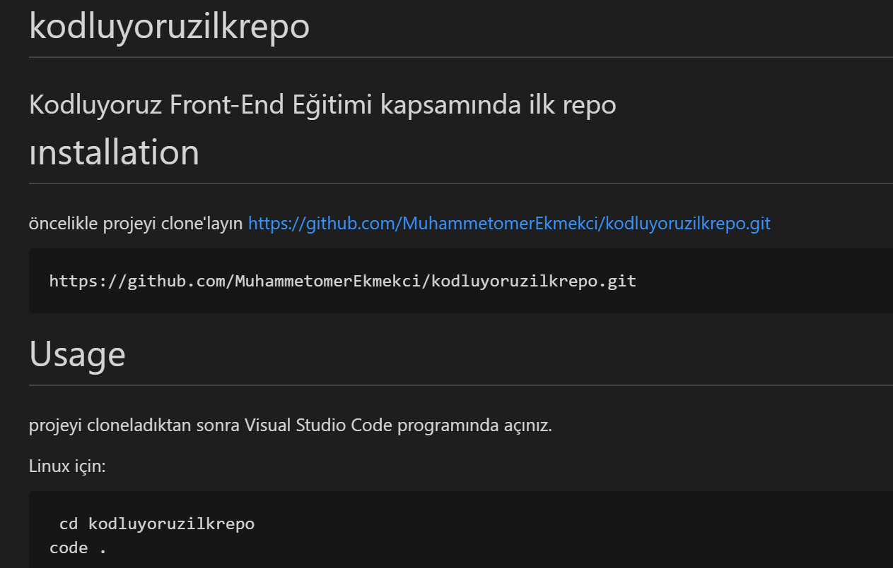

# kodluyoruzilkrepo
Kodluyoruz Front-End Eğitimi kapsamında ilk repo


-
# ınstallation
öncelikle projeyi clone'layın https://github.com/MuhammetomerEkmekci/kodluyoruzilkrepo.git

```
https://github.com/MuhammetomerEkmekci/kodluyoruzilkrepo.git
```
# Usage
projeyi cloneladıktan sonra Visual Studio Code programında açınız.

Linux için:
```
 cd kodluyoruzilkrepo
code .
```

# Contributing
Pull requestler kabul edilir. Büyük değişiklikler için, lütfen önce neyi değiştirmek istediğinizi tartışmak için bir konu açınız.

 # Licence
  [MIT]()


